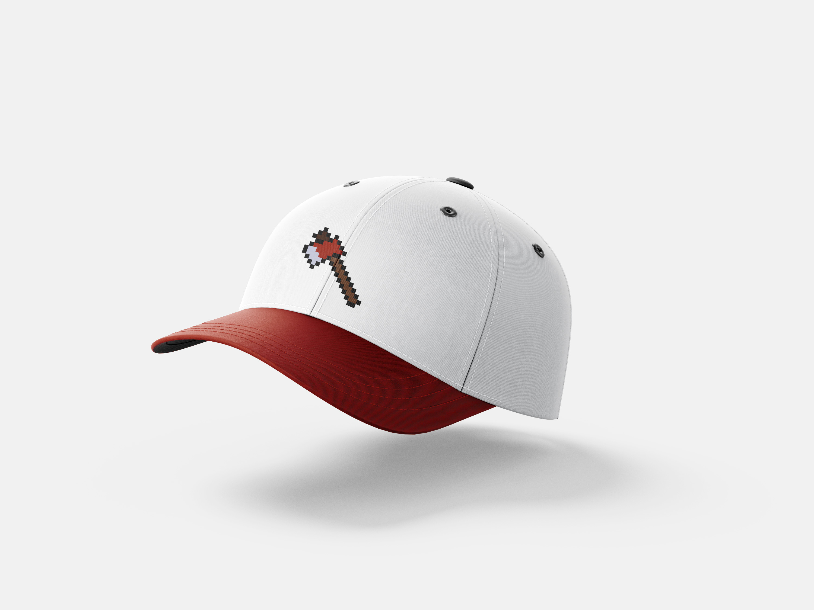

#             EARTH KEEPER
#### por Jaime Conceição e Pedro Henriques 
## Projeto desenvolvido no âmbito da Unidade Curricular de Design Multimédia, dirigida pelos docentes André Rocha e José Basto.

## Tópico 1: Conjunto de layouts
// texto
1. Protótipo de baixa definição
[prototipo_altadefinição](https://youtu.be/0SvJkbfCoRE)

2. Protótipo de alta definição
[prototipo_altadefinição](https://youtu.be/q6ozkvQXaGU)

3. Layouts 
    -Personagem Principal

    -Obstáculos

    -Background

## Tópico 2: Design de Comunicação	
// texto
1. Identidade gráfica:
- Logotipo

2. Aplicabilidade da marca:
- T-shirt

- Hoodie

- Cap´s

- Brindes - Porta-chaves

- Brindes - Tapete de rato

## Tópico 3: Vídeo
// texto
[videopromocional](....)

## Tópico 4: Jogo
// texto
[jogo](....)
